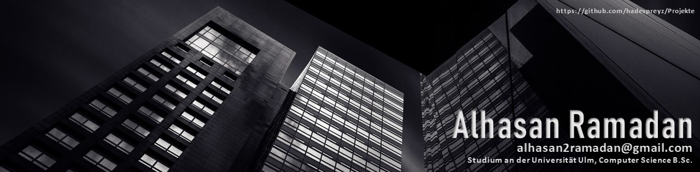

  
  

# ⚙️ What Tools/Languages i use:

# 🔭 I’m currently working on ...
A group project in university
# 🌱 I’m currently learning ...
How clients, servers, and editors work, for the group project
# 👯 I’m looking to collaborate on ...
Front-end Development
# 🤔 I’m looking for help with ...

# 📫 How to reach me: 

# ⚡ Fun fact: 
HIMYM > Big Bang Theory

